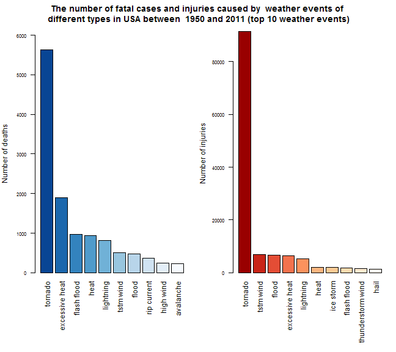
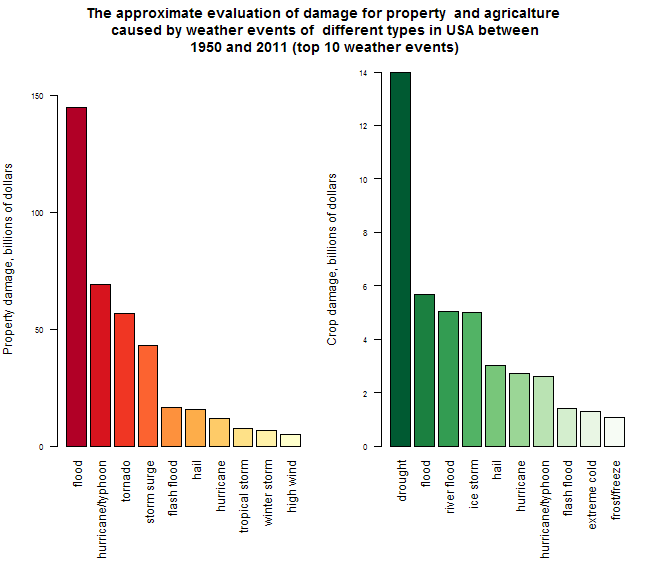
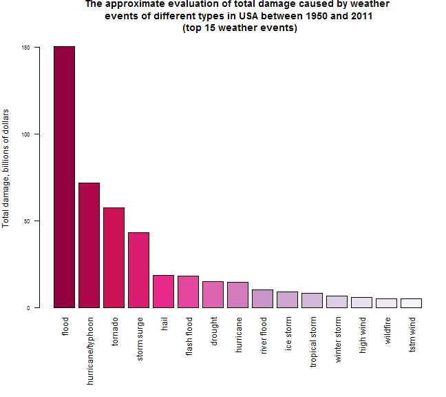

# Consequences of Different Weather Events on Population Health and Economic in USA Between 1950 and 2011


## Synopsis

This is an observational study that is aimed at summarising data about the economic 
damage and harm to population health caused by different weather events in USA 
between 1950 and 2011. To investigate this study, we obtained data from the U.S. 
National Oceanic and Atmospheric Administration's (NOAA) storm database. From 
these data, we found that, the biggest total damage to economic was caused by 
floods, hurricanes/typhoons, tornadoes and storm surges. Tornadoes and floods 
along with heat and strong wind are also the main causes of death and injuries 
cases among all weather events.

## Data Processing

### Data source

The data was obtained from U.S. National Oceanic and Atmospheric Administration's
(NOAA) storm database. This database tracks characteristics of major storms and 
weather events in the United States, including when and where they occur, as well 
as estimates of any fatalities, injuries, and property damage. Additional 
description for this dataset is available in [Storm Data Documentation](https://d396qusza40orc.cloudfront.net/repdata%2Fpeer2_doc%2Fpd01016005curr.pdf) and [National Climatic Data Center Storm Events FAQ](https://d396qusza40orc.cloudfront.net/repdata%2Fpeer2_doc%2FNCDC%20Storm%20Events-FAQ%20Page.pdf).

### Download and read the data


```r
if (!file.exists("FStormData.csv.bz2")) {
    download.file("https://d396qusza40orc.cloudfront.net/repdata%2Fdata%2FStormData.csv.bz2", 
        "FStormData.csv.bz2", mode = "wb")
}
data <- read.table(bzfile("FStormData.csv.bz2"), header = TRUE, sep = ",", allowEscapes = TRUE, 
    quote = "\"")
data$EVTYPE <- tolower(data$EVTYPE)
head(data[, 1:7])
```

```
##   STATE__           BGN_DATE BGN_TIME TIME_ZONE COUNTY COUNTYNAME STATE
## 1       1  4/18/1950 0:00:00     0130       CST     97     MOBILE    AL
## 2       1  4/18/1950 0:00:00     0145       CST      3    BALDWIN    AL
## 3       1  2/20/1951 0:00:00     1600       CST     57    FAYETTE    AL
## 4       1   6/8/1951 0:00:00     0900       CST     89    MADISON    AL
## 5       1 11/15/1951 0:00:00     1500       CST     43    CULLMAN    AL
## 6       1 11/15/1951 0:00:00     2000       CST     77 LAUDERDALE    AL
```


The dataset contains variables:


```r
names(data)
```

```
##  [1] "STATE__"    "BGN_DATE"   "BGN_TIME"   "TIME_ZONE"  "COUNTY"    
##  [6] "COUNTYNAME" "STATE"      "EVTYPE"     "BGN_RANGE"  "BGN_AZI"   
## [11] "BGN_LOCATI" "END_DATE"   "END_TIME"   "COUNTY_END" "COUNTYENDN"
## [16] "END_RANGE"  "END_AZI"    "END_LOCATI" "LENGTH"     "WIDTH"     
## [21] "F"          "MAG"        "FATALITIES" "INJURIES"   "PROPDMG"   
## [26] "PROPDMGEXP" "CROPDMG"    "CROPDMGEXP" "WFO"        "STATEOFFIC"
## [31] "ZONENAMES"  "LATITUDE"   "LONGITUDE"  "LATITUDE_E" "LONGITUDE_"
## [36] "REMARKS"    "REFNUM"
```


### Modify data

The column we are interested in is the EVTYPE which is the main explanatory 
variable in our analysis and represents the type of weather event occured. 
Another columns of interest are FATALITIES, INJURIES, PROPDMG, and CROPDMG which 
are response variables in our analysis and are related to population health, and 
economic damage caused by different types of weather events.

The amount of damage is presented in PROPDMG and CROPDMG variables, but there are 
also two additional variables PROPDMGEXP, and CROPDMGAEXP, that are represent 
precision of damage data. Aphabetical characters used to signify magnitude include 
“K” for thousands, “M” for millions, and “B” for billions. Additional precision 
may also be provided. So we need to change our damage variables for crop and 
property damage, in order to represent it more obvious way.


```r
summary(data$PROPDMGEXP)
```

```
##             -      ?      +      0      1      2      3      4      5 
## 465934      1      8      5    216     25     13      4      4     28 
##      6      7      8      B      h      H      K      m      M 
##      4      5      1     40      1      6 424665      7  11330
```

```r
summary(data$CROPDMGEXP)
```

```
##             ?      0      2      B      k      K      m      M 
## 618413      7     19      1      9     21 281832      1   1994
```

```r
prop_dmg <- rep(0, times = dim(data)[1])
crop_dmg <- rep(0, times = dim(data)[1])
prop_dmg[data$PROPDMGEXP == "K" | data$PROPDMGEXP == "k"] <- 1000
prop_dmg[data$PROPDMGEXP == "M" | data$PROPDMGEXP == "m"] <- 1e+06
prop_dmg[data$PROPDMGEXP == "B" | data$PROPDMGEXP == "b"] <- 1e+09
crop_dmg[data$CROPDMGEXP == "K" | data$CROPDMGEXP == "k"] <- 1000
crop_dmg[data$CROPDMGEXP == "M" | data$CROPDMGEXP == "m"] <- 1e+06
crop_dmg[data$CROPDMGEXP == "B" | data$CROPDMGEXP == "b"] <- 1e+09
for (x in as.character(0:9)) {
    prop_dmg[data$PROPDMGEXP == x] <- 10^as.numeric(x)
    crop_dmg[data$CROPDMGEXP == x] <- 10^as.numeric(x)
}
data$PROPDMG <- data$PROPDMG * prop_dmg
data$CROPDMG <- data$CROPDMG * crop_dmg
```


Missing values are a common problem with environmental data and so we check to 
see what proportion of the observations are missing for variables of interest 
(i.e. coded as NA).


```r
mean(complete.cases(data$EVTYPE, data$FATALITIES, data$INJURIES, data$PROPDMG, 
    data$CROPDMG))
```

```
## [1] 1
```


As we can see, the dataset do not contain any missing data for selected variables.

## Results

### Population health consequences

The first question we have investigated is how weather events of different types 
in USA affect population health. The dataset contains two variables related to 
this question FATALITIES and INJURIES. Here we can see the total number of deaths 
and injuries caused by all weather events between 1950 and 2011 in USA:


```r
sum(data$FATALITIES)
```

```
## [1] 15145
```

```r
sum(data$INJURIES)
```

```
## [1] 140528
```


At next graph we have exemined what kind of weather events are more harmfull 
related to population health.


```r
par(mar = c(9, 4, 1, 1), mfrow = c(1, 2), oma = c(0, 0, 3, 0))
library(RColorBrewer)
cols1 <- brewer.pal(8, "Blues")
pal1 <- colorRampPalette(cols1)
cols2 <- brewer.pal(8, "OrRd")
pal2 <- colorRampPalette(cols2)
fatality_data <- sort(tapply(data$FATALITIES, data$EVTYPE, sum), decreasing = TRUE)
injury_data <- sort(tapply(data$INJURIES, data$EVTYPE, sum), decreasing = TRUE)
barplot(fatality_data[1:10], las = 2, ylim = c(0, 6000), ylab = "Number of deaths", 
    cex.axis = 0.7, col = pal1(10)[10:1])
barplot(injury_data[1:10], las = 2, ylim = c(0, 90000), ylab = "Number of injuries", 
    cex.axis = 0.7, col = pal2(10)[10:1])
title(outer = TRUE, main = paste("The number of fatal cases and injuries caused by ", 
    "weather events of\n different types in USA between", " 1950 and 2011 (top 10 weather events)"))
```

 

```r
rest_fatal <- sum(fatality_data[16:length(fatality_data)])
rest_inj <- sum(injury_data[16:length(injury_data)])
tornado_inj_percentage <- injury_data[1]/sum(injury_data[1:length(injury_data)]) * 
    100
tornado_killed_percentage <- fatality_data[1]/sum(fatality_data[1:length(fatality_data)]) * 
    100
```


As we can see, the most dangerous weather event that causes the largest number of 
both death cases and injuries is USA are tornadoes. Relatively high number of 
deaths and injuries also caused by heat, flood, wind, and lightning events. The 
rest of weather events that are not presented on graph caused total number 2187 
of deaths and 9315 injuries. The percentages of injured and killed by 
tornado in USA between 1950 and 2011 to total number of injured and killed in all 
weather events are 65.002%, and 37.1938% respectively.

### Economic consequences

Now let exemine which types of events have the greatest economic consequences 
across the United States. There are two variables in the Storm Data dataset, 
PROPDMG and CROPDMG, that represent aproximal evaluation of property and crop 
damage caused by weather events of different types. On the next graph we have 
investigated what kind of events have had the biggest economic consequences.


```r
par(mar = c(9, 4, 1, 1), mfrow = c(1, 2), oma = c(0, 0, 4, 0))
cols1 <- brewer.pal(8, "YlOrRd")
pal1 <- colorRampPalette(cols1)
cols2 <- brewer.pal(8, "Greens")
pal2 <- colorRampPalette(cols2)
prop_data <- sort(tapply(data$PROPDMG, data$EVTYPE, sum), decreasing = TRUE)
crop_data <- sort(tapply(data$CROPDMG, data$EVTYPE, sum), decreasing = TRUE)
barplot(prop_data[1:10]/1e+09, las = 2, ylab = "Property damage, billions of dollars", 
    cex.axis = 0.7, col = pal1(10)[10:1], ylim = c(0, 160))
barplot(crop_data[1:10]/1e+09, las = 2, ylab = "Crop damage, billions of dollars", 
    cex.axis = 0.7, col = pal2(10)[10:1], ylim = c(0, 14))
title(outer = TRUE, main = paste("The approximate evaluation of damage for property ", 
    "and agricalture\n caused by weather events of ", "different types in USA between\n 1950 and 2011", 
    "(top 10 weather events)"))
```

 

```r
rest_prop <- sum(prop_data[11:length(prop_data)])/1e+09
rest_crop <- sum(crop_data[11:length(crop_data)])/1e+09
```


The biggest damage for property was caused by floods, hurricanes/typhoons, 
tornadoes and storms (in decreasing order). While for agriculture the biggest 
damage was caused by droughts, floods and ice storms. The rest of weather events 
that are not presented on graph counts total amount of 49.9017 billions of 
dollars damage for property and 7.2139 billions for crop.

The next graph depicts the total economical damage from weather events of 
different types:


```r
par(mar = c(9, 4, 3, 1), mfrow = c(1, 1), oma = c(0, 0, 0, 0))
cols <- brewer.pal(8, "PuRd")
pal <- colorRampPalette(cols)
total_data <- sort(tapply(data$PROPDMG + data$CROPDMG, data$EVTYPE, sum), decreasing = TRUE)
barplot(total_data[1:15]/1e+09, las = 2, ylab = "Total damage, billions of dollars", 
    cex.axis = 0.7, col = pal(15)[15:1], ylim = c(0, 160))
title(main = paste("The approximate evaluation of total damage caused by weather\n", 
    "events of different types in USA between 1950 and 2011\n", " (top 15 weather events)"))
```

 

```r
rest_total <- sum(total_data[16:length(total_data)])/1e+09
total_damage <- sum(total_data)/1e+09
flood_percentage <- total_data[1]/sum(total_data[1:length(total_data)]) * 100
```


The greatest economic consequences was caused by floods, hurricanes/typhoons, 
tornadoes and storms (in decreasing order). The total amount of damage caused by 
different weather events between 1950 and 2011 in USA counts 477.3291 
billions of dollars. Weather events that are not presented on graph caused total 
amount of 37.5544 billions of dollars damage. The percentage of damage 
caused by floods to total damage caused by all weather events between 1950 and 
2011 is 31.4918%


The data was provided by Reproducible Research course, Coursera.

